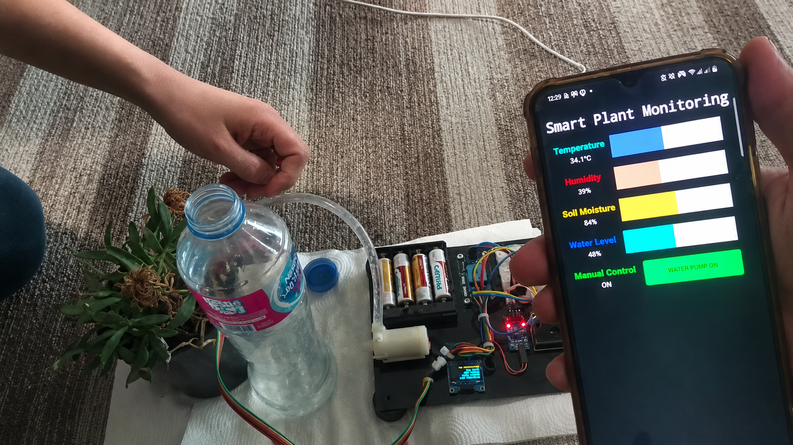
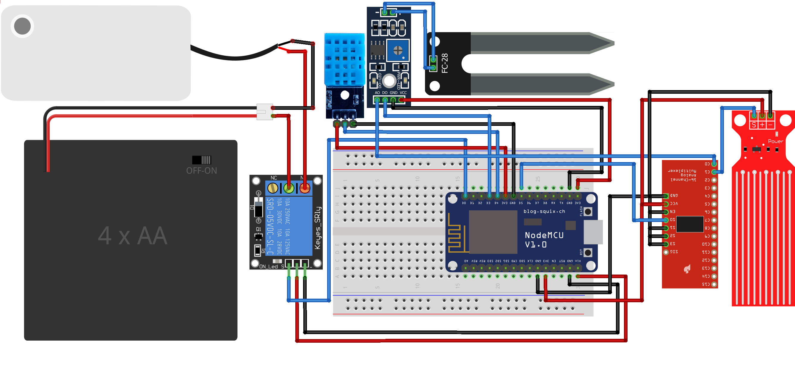
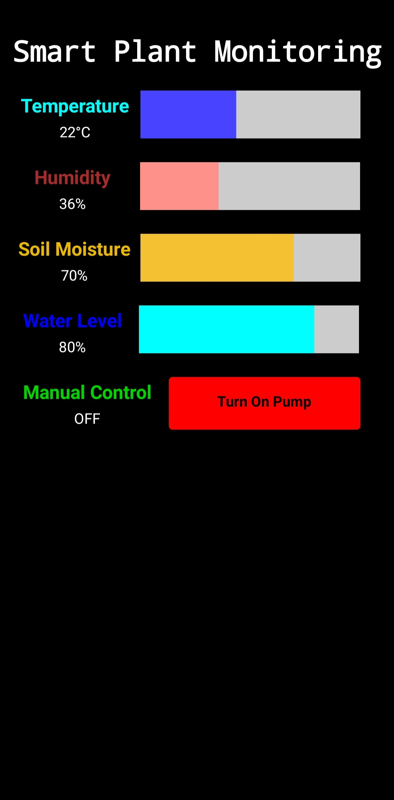
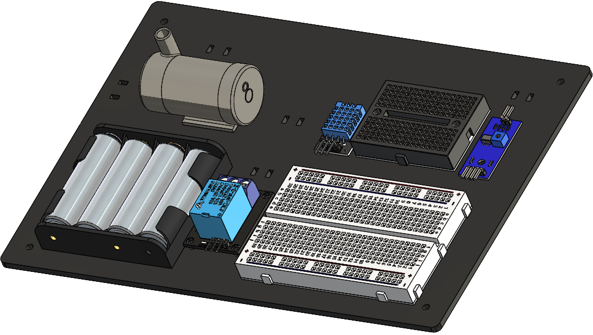

# IoT Smart Plant Monitoring and Irrigation System

Smart plant monitoring and irrigation system using ESP8266 that can measure temperature, humidity, soil moisture and water level, upload the readings to Firebase Realtime Database, display the live values on an OLED screen and control a water pump automatically or manually from a mobile application.



## Project Links

- [Watch the system demonstration on YouTube](https://youtu.be/aI00_OWCgdE)
- [View and download the CAD assembly on GrabCAD](https://grabcad.com/library/iot-smart-plant-monitoring-and-irrigation-system-1)

## Main Features

- ESP8266 NodeMCU firmware for sensor reading, cloud updates, OLED display output, and pump control.
- DHT11 temperature and humidity reading implemented through timing pulses.
- Soil-moisture and water-level readings through the ESP8266 analog input using a 74HC4051 multiplexer.
- Firebase Realtime Database integration for remote monitoring and manual pump control.
- MIT App Inventor mobile application for live sensor values and manual pump control.
- OLED display for local monitoring.
- Test-case generation and verification for the pump-control decision logic.

## System Overview

The system gathers environmental and plant state readings from multiple sensors. The ESP8266 uses these values to decide if the plant needs to be irrigated. A water-level sensor is used as a master safety condition to prevent the pump from operating when the water level is above the threshold.



The mobile application reads values from Firebase and can write a manual pump-control signal. The firmware merges this manual command with the automatic control decisions.

A complete demonstration of the working system is available on [YouTube](https://youtu.be/aI00_OWCgdE).



## Hardware and Mechanical Design

The prototype combines the electronics, pump, reservoir, and plant into a single physical setup.

The complete CAD assembly and laser-cut base design are also available on [GrabCAD](https://grabcad.com/library/iot-smart-plant-monitoring-and-irrigation-system-1).



## Control Logic

The pump-control decision is based on four main conditions:

| Signal | Meaning |
|---|---|
| `MasterControl` | Water-level safety condition. The pump is disabled when water is above the threshold. |
| `Decision1` | Soil is dry enough to require watering. |
| `Decision2` | Temperature is high enough to trigger watering. |
| `ManualControl` | User requested pump operation through Firebase/mobile app. |

The pump is only operated when the master water-level condition is satisfied. Then it switches on if the user requests manual irrigation, the soil is dry, or the temperature is high.

## Why a Multiplexer Was Used

The ESP8266 has only one analog input. The project uses a 74HC4051 multiplexer to connect multiple analog sensors to the same input. This avoids adding a second microcontroller and keeps the prototype smaller and less complex.

## Firmware Structure

```text
firmware/
└── SmartPlantMonitoring/
    ├── SmartPlantMonitoring.ino
    ├── helper_functions.h
    ├── helper_functions.cpp
    └── credentials.example.h
```

Create your local credentials file before uploading the firmware:

```bash
cp firmware/SmartPlantMonitoring/credentials.example.h firmware/SmartPlantMonitoring/credentials.h
```

Then edit `credentials.h` with your Wi-Fi and Firebase project values.

## Required Arduino Libraries

Install the following libraries in the Arduino IDE:

- ESP8266 board support package
- Firebase ESP Client
- ESP8266WiFi
- SSD1306Wire / ESP8266 OLED driver
- Wire

## Test-Case Verification

The `tests/` folder contains a Python generator and C++ verification program for the pump-control decision logic.

The generator lists combinations of the water level state, Firebase readiness, signup state, manual command state, soil moisture state, and temperature state. The verifier checks the expected master-control, decision, manual-control, slave-control and pump-status outputs.

## Limitations

- The prototype is a single-plant project, and not suitable in its current form for agricultural deployment, but it can be expanded to be suitable.
- The system depends on Firebase availability for remote monitoring and manual control.
